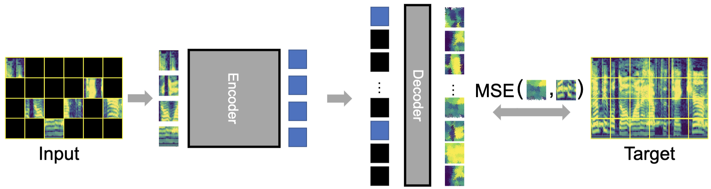
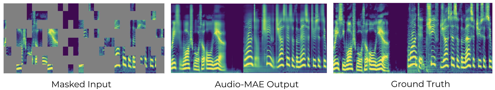

# Audio-MAE


This repo hosts the code and models of "[Masked Autoencoders that Listen](http://arxiv.org/abs/2207.06405)" [NeurIPS 2022 [bib](https://github.com/facebookresearch/AudioMAE#citation)].


<p align="center">
  
</p>


### Demo Examples
<p align="center">
  
</p>

[Music](https://www.dropbox.com/s/96v5et19521hlau/Fig6_b.mp4?dl=0), [Speech](https://www.dropbox.com/s/tyzjc9sk6wch1zk/Fig6_a.mp4?dl=0), [Event Sound](https://www.dropbox.com/s/rgmqgulnl1l9mu2/Fig6_c.mp4?dl=0)


### 1. Installation
- This repo follows the [MAE repo](https://github.com/facebookresearch/mae), Installation and preparation follow that repo.
- Copy files and patch the timm package by ``bash timm_patch.sh'' (Please change the path to your own timm package path). We use timm==0.3.2, for which a [fix](https://github.com/rwightman/pytorch-image-models/issues/420#issuecomment-776459842) is needed to work with PyTorch 1.8.1+.
- Please find [mae_env.yml](./mae_env.yml) for all the dependencies.
- You may also use download the conda-packed [conda env](https://drive.google.com/file/d/1ECVmVyscVqmhI7OQa0nghIsWVaZhZx3q/view?usp=sharing), untar it, and then:
```
source path_to_env/bin/activate
```

### 2. Prepare data:
Please try to download AudioSet [here](https://research.google.com/audioset/). Due to copyright we cannot release the data. The data annotation json parased and used in this work is available [here](https://drive.google.com/file/d/1cAiaL69HFm1zSW4hqFQpdhNfHiVKBFNA/view?usp=share_link). The format follows the one in [AST](https://github.com/YuanGongND/ast). Please be sure to modify the path in the scripts accordingly to reflect your own setup.

### 3. Pretrianing on AudioSet-2M
For the brave ones to pre-train on AudioSet-2M: Please use the pretrain_audioset2M.sh by:
```
bash pretrain_audioset2M.sh
```
### 4. Fine-tuning on AudioSet-2M and AudioSet-20K
For Finetuning from an AuioSet-pretrained model. Please use your own pretrained model from the previous step or download our pre-trained [ckpt](https://drive.google.com/file/d/1rRsmU8x7D-x4BvcPyroUJwU18eixNfKg/view?usp=sharing) and put it under ./ckpt. Please use the script submit_ft_mask_bal.sh by 
```
bash submit_ft_mask_bal.sh 2e-4 0.2 0.2 ./ckpt/pretrained.pth"
```
This will perform weighted distributed sampling on the unbalanded Audioset to fine-tuned the model with class-balanced data for 100 epochs. The resulting mAP on the AudioSet should be around 47.3. We provide our finetuned checkpoint at [here](https://drive.google.com/file/d/1dacJa-XcaoLPZf--mLvzSdlzo5iMX2ST/view?usp=share_link). An example log of finetuning is as follows:
```
[07:10:32.717347] log_dir: /checkpoint/berniehuang/experiments/419909
[07:10:36.394431] Epoch: [99]  [  0/781]  eta: 0:47:51  lr: 0.000001  loss: 0.0066 (0.0066)  time: 3.6761  data: 1.6724  max mem: 2606
[07:12:24.728503] Epoch: [99]  [500/781]  eta: 0:01:02  lr: 0.000001  loss: 0.0116 (0.0128)  time: 0.2130  data: 0.0002  max mem: 2606
[07:13:24.602830] Epoch: [99]  [780/781]  eta: 0:00:00  lr: 0.000001  loss: 0.0122 (0.0128)  time: 0.1837  data: 0.0003  max mem: 2606
[07:13:24.853957] Epoch: [99] Total time: 0:02:52 (0.2204 s / it)
[07:13:25.085416] Averaged stats: lr: 0.000001  loss: 0.0122 (0.0126)
[07:13:28.343364] Test:  [ 0/79]  eta: 0:02:01    time: 1.5353  data: 1.5029  max mem: 2606
[07:13:30.942012] Test:  [78/79]  eta: 0:00:00    time: 0.0206  data: 0.0001  max mem: 2606
[07:13:31.180169] Test: Total time: 0:00:04 (0.0554 s / it)
[07:13:42.547896] mAP: 0.472873
[07:13:42.552120] mAP of the network on the 19148 test images: 0.4728
[07:13:42.552198] Max mAP: 0.473
[07:13:42.566228] Training time 5:16:14
submitit INFO (2022-04-22 07:13:43,404) - Job completed successfully
```

You can also try fine-tuning on AudioSet-20K for 60 epochs with
```
sbatch ft_as.sh 1e-3 ./ckpt/pretrained.pth
```
The log.txt will look like:
```
{"train_lr": 2.1997867184321786e-06, "train_loss": 0.01310475811136991, "test_mAP": 0.36981118189071294, "epoch": 56, "n_parameters": 85659407}
{"train_lr": 1.6171788925401227e-06, "train_loss": 0.01304934614071496, "test_mAP": 0.37001905352752995, "epoch": 57, "n_parameters": 85659407}
{"train_lr": 1.2277041313086816e-06, "train_loss": 0.013038477757025324, "test_mAP": 0.36998449127640076, "epoch": 58, "n_parameters": 85659407}
{"train_lr": 1.0325878664284776e-06, "train_loss": 0.012981618695671238, "test_mAP": 0.36999196624276054, "epoch": 59, "n_parameters": 85659407}
```
The peformance on AudioSet-20K is around 37.0 mAP. 

### 5. Inference 
For inference the finetuned model. Please put your finetuned model under ./ckpt, or please download our finetuned [ckpt](https://drive.google.com/file/d/1dacJa-XcaoLPZf--mLvzSdlzo5iMX2ST/view?usp=share_link). Then:
```
bash inf.sh ckpt/finetuned.pth
```
This should give you 47.3 mAP on AudioSet. An example log is as follows:
```
[18:22:12.877430] number of params (M): 85.66
[18:22:12.877460] base lr: 2.00e-03
[18:22:12.877479] actual lr: 1.25e-04
[18:22:12.877495] accumulate grad iterations: 1
[18:22:12.877511] effective batch size: 16
[18:22:12.898235] criterion = BCEWithLogitsLoss()
[18:22:14.068845] Test:  [   0/1197]  eta: 0:23:19    time: 1.1690  data: 1.0901  max mem: 1035
[18:22:55.447027] Test:  [ 300/1197]  eta: 0:02:06    time: 0.1402  data: 0.0001  max mem: 1046
[18:23:37.699615] Test:  [ 600/1197]  eta: 0:01:24    time: 0.1411  data: 0.0001  max mem: 1061
[18:24:20.110863] Test:  [ 900/1197]  eta: 0:00:41    time: 0.1417  data: 0.0001  max mem: 1075
[18:25:02.194206] Test:  [1196/1197]  eta: 0:00:00    time: 0.1526  data: 0.0001  max mem: 1090
[18:25:02.321579] Test: Total time: 0:02:49 (0.1415 s / it)
[18:25:11.997641] mAP: 0.472873
[18:25:12.004128] Accuracy of the network on the 19148 test images: 0.4729
```
Per-class AP can be found under ./aps.txt and per-example results is inf_output.npy

### Updates
- [x] Code and Model Release
- [x] Provide conda-pack envs
- [ ] Notebook Demos
- [ ] Additional Exps

### Citation
```
@inproceedings{huang2022amae,
  title = {Masked Autoencoders that Listen},
  author = {Huang, Po-Yao and Xu, Hu and Li, Juncheng and Baevski, Alexei and Auli, Michael and Galuba, Wojciech and Metze, Florian and Feichtenhofer, Christoph}
  booktitle = {NeurIPS},
  year = {2022}
}
```

### Contact
Please contact Bernie Huang (berniehuang@meta.com) if you have any questions. Thank you.

### Reference
The codebase is based on the awesome [MAE](https://github.com/facebookresearch/mae) and [AST](https://github.com/YuanGongND/ast) repos.

### License
This project is under the CC-BY 4.0 license. See [LICENSE](LICENSE) for details.
